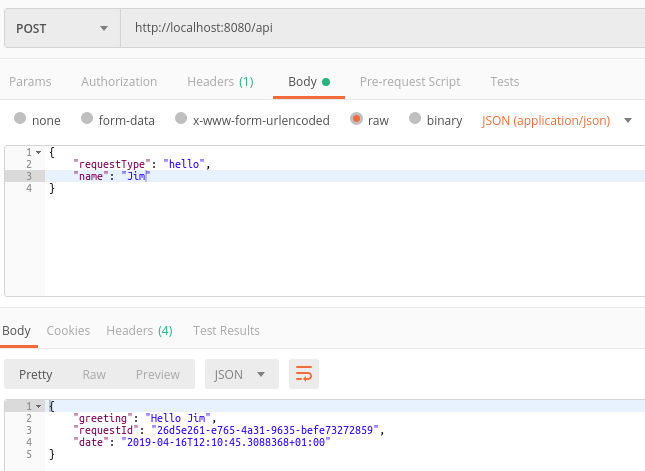

## Walkthrough 1 - Hello World
This walkthrough will take you through the process of building a very simple service that will allow us to ask a it to say "hello" to you personally.  How exciting :D

You may feel that you're doing a lot of work for such a feeble payout and you'd be correct, there are much easier ways to get a computer to say hello to you.  However, LogicMine has been designed with complex applications in mind that are liable to be actively worked on over years and probably by teams of developers.  In such cases putting in a little extra effort at the start can come with massive rewards.

Now, onwards...

#### 1 . Create a new Web API project

```dotnet new webapi```

#### 2. Add a reference to [LogicMine.Web](https://www.nuget.org/packages/LogicMine.Web/)

```dotnet add package LogicMine.Web```

#### 3. Create the application request Controller
All types of request come into a LogicMine service through a single Web API controller.  The LogicMine framework covers everything that's needed however you need to provide an access point.  Create a new class called *MyRequestController* and add the following:

```csharp
using LogicMine;
using LogicMine.Routing;
using LogicMine.Web;
using Microsoft.AspNetCore.Mvc;
using Newtonsoft.Json.Linq;
    
namespace HelloWorld.Controllers
{
    [Route("api")]
	public class MyRequestController : JsonRequestController
	{
	    public MyRequestController(IRequestRouter<JObject> requestRouter) : base(requestRouter)
	    {
	    }
	}
}
```

#### 4. Define a request
LogicMine services are message based and we'll define our request as:

```csharp
using LogicMine;
    
namespace HelloWorld.Mine
{
    public class HelloRequest : Request
	{
	    public string Name { get; set; }
	}
}
```

#### 5. Define a response
The response to a *HelloRequest* will look like:

```csharp
using LogicMine;
    
namespace HelloWorld.Mine
{
    public class HelloResponse : Response<HelloRequest>
	{
	    public string Greeting { get; set; }

	    public HelloResponse(HelloRequest request) : base(request)
	    {
	    }
	}
}
```

#### 6. Define a terminal
Each request travels down a processing pipeline (in LogicMine parlance this is referred to as a *Shaft*).  At the bottom of every shaft is a terminal and this is where a response to a request is generated.

You will notice that the request and response travel through the shaft in an *IBasket*.  We'll get into more details on baskets in a later walk-through. For now it is enough to know that this is where our request is held and where we'll put the response. 

In a production application it is highly likely that terminals will perform operations that benefit from asynchronous processing, e.g. querying a database, calling a web service, etc.  For this reason all touchpoints within LogicMine allow for asynchronous processing.  With our simple example though there is no need for this so we just return a completed task to signify that the work within the terminal has finished. 

```csharp
using System.Threading.Tasks;
using LogicMine;
    
namespace HelloWorld.Mine
{
    public class HelloTerminal : Terminal<HelloRequest, HelloResponse>
	{
	    public override Task AddResponseAsync(IBasket<HelloRequest, HelloResponse> basket)
	    {
	        basket.Response = new HelloResponse(basket.Request) {Greeting = "Hello " + basket.Request.Name};
	        return Task.CompletedTask;
	    }
    }
}
```

 #### 7. Define a shaft registrar 
So far we've defined our request and response types and also the way in which a response will be generated from a request.  The next step is to stitch this stuff together so that when a *HelloRequest* comes into our service it can pass down an appropriate shaft so that it hits our *HelloTerminal*.  
 
For this we'll create a *ShaftRegistrar* which allows us to define the structure of our shaft and inject it into our applications *Mine* (a mine is the complete set of shafts for an application). 

```csharp
using LogicMine;
    
namespace HelloWorld.Mine
{
    public class HelloShaftRegistrar : ShaftRegistrar
	{
	    public override void RegisterShafts(IMine mine)
	    {
	        mine.AddShaft(new Shaft<HelloRequest, HelloResponse>(new HelloTerminal()));
	    }
	}
}
```

#### 8. Modify Startup.cs
If you created the service with *dotnet new webapi* then you should already have a Startup.cs file.  This needs to be modified so that everything that's needed to run our mine is set up.

There are many options here however we'll keep things simple for now.

LogicMine makes heavy use of the dependency-injection pattern and the standard .Net DI container is perfectly fine for our current needs.  We will tell the DI container about the *IRequestRouter*.

Request routers intercept requests and forward them to appropriate shafts.  You may have noticed that the *MyRequestController* class accepts such a construct.  Quite simply the code below is saying that an *IntelligentJsonRequestRouter* will get passed into this controller and this will then be used to route our requests.  

The use of the word "Intelligent" is perhaps a little misleading because there isn't really any magic going on here.  What the *IntelligentJsonRequestRouter* does do though that more trivial implementations of *IRequestRouter* may not is that it discovers all of the shafts registrars within the assembly given to it and automatically executes them.  This means that we can continue building upon our project without having to think about request routing again.

```csharp
using LogicMine;
using LogicMine.Routing;
using LogicMine.Web;
using Microsoft.AspNetCore.Builder;
using Microsoft.AspNetCore.Hosting;
using Microsoft.Extensions.DependencyInjection;
using Newtonsoft.Json.Linq;
    
namespace HelloWorld
{
    public class Startup
	{
	    public void ConfigureServices(IServiceCollection services)
	    {
	        var requestRouter = new IntelligentJsonRequestRouter(GetType().Assembly, services);

	        services
	            .AddSingleton(services)
	            .AddSingleton<IRequestRouter<JObject>>(requestRouter)
	            .AddMvc();
        }

	    public void Configure(IApplicationBuilder app, IHostingEnvironment env)
	    {
	        app.UseMvc();
	    }
	}
}
```

#### 9. Use service
All that's left now is to build and run the service and then use it.

The screenshot below is of a request sent to the service with Postman (however you can use any client you wish).  The request is at the top half of the image, i.e. 

**POST** to http://localhost:8080 
```json
{
    "requestType": "hello",
    "name": "Jim"
}
```

Which leads to a response of:

```json
{
    "greeting": "Hello Jim",
    "requestId": "6ab1a651-21b2-47ef-8903-c52929ef8df3",
    "date": "2019-04-16T12:34:30.4480137+01:00"
}
```




