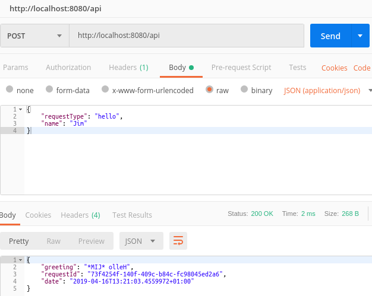

## Walkthrough 2 - Stations
Please make sure you have followed the first walkthrough as this one follows on from it.

This walkthrough will show you how to set up a basic processing pipeline and just as with the first walkthrough this is very contrived and there are much simpler ways to acheive what we'll be doing here.  The important thing to remember though is that with a real, complex application which will be modified over time the patterns we'll follow allow us to adhere to the [open-closed principle](https://en.wikipedia.org/wiki/Open%E2%80%93closed_principle) which means we greatly reduce the risk of introducing regressions - because we're not touching existing, working code. 

When a request enters a shaft it will pass through zero or more stations until it hits a terminal.  The terminal generates a response and then the request/response travel back up the shaft until it emerges and is handed to the caller.  We have already defined a terminal in the last walkthrough so now we'll create some stations which do things when the request is travelling down the shaft and also when the request/response is moving back up again.

#### 1. Open your Hello World walkthrough project
That's all.

*N.B. The code for these walkthroughs is included in the source respository, as a project per walkthrough.  The code within this walkthrough is taken from these projects and the namespaces will be slightly different to yours if you're following along with your own project.*

#### 2. Add a station to make requestors name uppercase
This station will simply catch the request on the way down and make the *Name* property upper case.

```csharp
using System.Threading.Tasks;
using LogicMine;

namespace Stations.Mine
{
    public class MakeNameUppercaseStation : Station<HelloRequest, HelloResponse>
    {
        public override Task DescendToAsync(IBasket<HelloRequest, HelloResponse> basket)
        {
            basket.Request.Name = basket.Request.Name.ToUpper();
            return Task.CompletedTask;
        }
    }
}
```

#### 3. Add a station to add asterisks around the requestors name
Well, why not!?

```csharp
using System.Threading.Tasks;
using LogicMine;

namespace Stations.Mine
{
    public class SurroundNameWithStarsStation : Station<HelloRequest, HelloResponse>
    {
        public override Task DescendToAsync(IBasket<HelloRequest, HelloResponse> basket)
        {
            basket.Request.Name = "*" + basket.Request.Name + "*";
            return Task.CompletedTask;
        }
    }
}
```

### 4. Add a station which reverses the response
This one is different to the last two because we want it to operate on the response rather than the request.

Because the majority of stations will act on requests (rather than responses) a design descision with LogicMine was to ensure that each station have a *DescendToAsync* method implementation - this is the method that is called on the downward journey.  In this case we do not want to do anything on the way down so we just return a completed task.

```csharp
using System.Linq;
using System.Threading.Tasks;
using LogicMine;

namespace Stations.Mine
{
    public class ReverseResponseStation : Station<HelloRequest, HelloResponse>
    {
        public override Task DescendToAsync(IBasket<HelloRequest, HelloResponse> basket)
        {
            return Task.CompletedTask;
        }

        public override Task AscendFromAsync(IBasket<HelloRequest, HelloResponse> basket)
        {
            basket.Response.Greeting = new string(basket.Response.Greeting.Reverse().ToArray());
            return Task.CompletedTask;
        }
    }
}
```

#### 5. Update HelloShaftRegistrar
We've 3 new stations that we want to add to our shaft and we do this by updating our existing shaft registrar.

Every shaft needs at least a terminal and we added this during the last walkthrough.  We'll now inject the 3 new stations.

Note that stations are visited in the order that they are added to the shaft.  So the complete flow through this shaft will be:

**Request travels down**

  1. ReverseResponseStation - does nothing
  2. MakeNameUppercaseStation - makes the name in the request uppercase
  3. SurroundNameWithStarsStation - surrounds the (now uppercase) name with asterisks

**Terminal is reached**

  4. HelloTerminal - creates the response greeting

**Request/Response travel up**
  
  5. SurroundNameWithStarsStation - does nothing
  6. MakeNameUppercaseStation - does nothing
  7. ReverseResponseStation - reverses the response greeting

```csharp
using LogicMine;

namespace Stations.Mine
{
    public class HelloShaftRegistrar : ShaftRegistrar
    {
        public override void RegisterShafts(IMine mine)
        {
            mine.AddShaft(new Shaft<HelloRequest, HelloResponse>(new HelloTerminal(),
                new ReverseResponseStation(),
                new MakeNameUppercaseStation(),
                new SurroundNameWithStarsStation()));
        }
    }
}
```

#### 6. Use the service
The screenshot below shows our updated service being called with Postman


