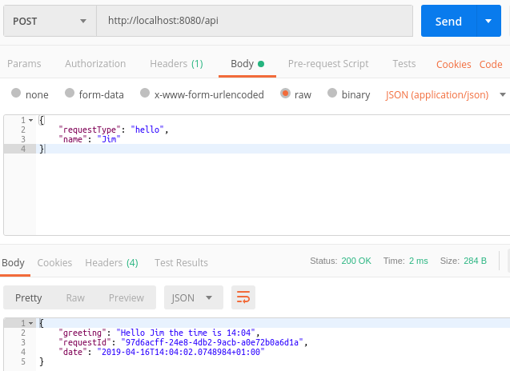

## Walkthrough 3 - Cross Shaft
Please make sure you have followed at least the first walkthrough as this one follows on from it.

In any real application it's almost certain that you will want to perform certain complex operations in multiple contexts, e.g. get a customer from a database, call a web service process the result, etc.

LogicMine will not stand in your way if you want to encapsulate such functionality within classes/libraries which have nothing to do with LogicMine however there is support for building this type of functionality into your LogicMine project and this walkthrough will show you how.

#### 1. Open your Hello World walkthrough project
That's all.

*N.B. The code for these walkthroughs is included in the source respository, as a project per walkthrough.  The code within this walkthrough is taken from these projects and the namespaces will be slightly different to yours if you're following along with your own project.*

#### 2. Create a GetTimeRequest type
As you may have guessed we're going to create a new operation which returns the time...how thrilling!

```csharp
using LogicMine;

namespace CrossShaft.Mine.GetTime
{
    public class GetTimeRequest : Request
    {
    }
}
```

#### 3. Create a response to hold the time

```csharp
using LogicMine;

namespace CrossShaft.Mine.GetTime
{
    public class GetTimeResponse : Response<GetTimeRequest>
    {
        public string Time { get; set; }
        
        public GetTimeResponse(GetTimeRequest request) : base(request)
        {
        }
    }
}
```

#### 4. Create a terminal to get the time

```csharp
using System;
using System.Threading.Tasks;
using LogicMine;

namespace CrossShaft.Mine.GetTime
{
    public class GetTimeTerminal : Terminal<GetTimeRequest, GetTimeResponse>
    {
        public override Task AddResponseAsync(IBasket<GetTimeRequest, GetTimeResponse> basket)
        {
            basket.Response = new GetTimeResponse(basket.Request) {Time = DateTime.Now.ToShortTimeString()};
            return Task.CompletedTask;
        }
    }
}
```

#### 5. Create a shaft registrar for our new operation

```csharp
using LogicMine;

namespace CrossShaft.Mine.GetTime
{
    public class GetTimeShaftRegistrar : ShaftRegistrar
    {
        public override void RegisterShafts(IMine mine)
        {
            mine.AddShaft(new Shaft<GetTimeRequest, GetTimeResponse>(new GetTimeTerminal()));
        }
    }
}
```

#### 6. Add the time to our previously returned greeting
Replace your current *HelloTerminal* code with that shown below (N.B. your namespace may be different).

This code submits a *GetTimeRequest* to the mine and once it gets the response it adds the time to the greeting. You will notice that this time round we're performing an asynchronous operation and so we no longer need to return Task.Completed.

The call to submit the request requires some explaination.  The odd looking *Within.Within* reference reflects the structure of a mine; we are currently in a terminal and are therefore *Within* a shaft and this shaft is *Within* a mine.  In other words, *Within* gives us our current shaft and *Within.Within* gives us our mine.

When we send the request into the mine we also pass in our current basket (which contains the request and will soon also contain the response). Something we'll discuss in a later walkthrough are the tracing facilities built into LogicMine but for now it's enough to know that this allows for this new request to be associated with the original one.

```csharp
using System.Threading.Tasks;
using CrossShaft.Mine.GetTime;
using LogicMine;

namespace CrossShaft.Mine.Hello
{
    public class HelloTerminal : Terminal<HelloRequest, HelloResponse>
    {
        public override async Task AddResponseAsync(IBasket<HelloRequest, HelloResponse> basket)
        {
            var timeResponse = await Within.Within
                .SendAsync<GetTimeRequest, GetTimeResponse>(basket, new GetTimeRequest()).ConfigureAwait(false);

            basket.Response = new HelloResponse(basket.Request)
            {
                Greeting = $"Hello {basket.Request.Name} the time is {timeResponse.Time}"
            };
        }
    }
}
```

#### 7. Use the service
The screenshot below shows our updated service being called with Postman



#### 8. Bonus!
An added Brucie bonus is that we can also use the GetTime shaft independently, see the request below.

N.B. If for whatever reason we didn't want this operation to be accessible to the outside world we can do this - details will be covered in the later security walkthrough.


