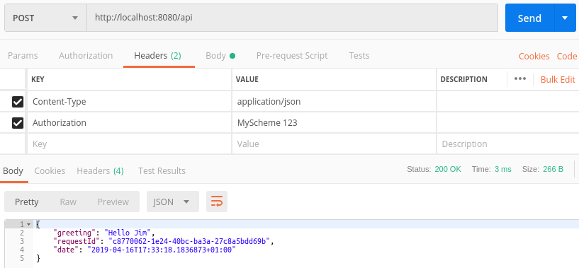
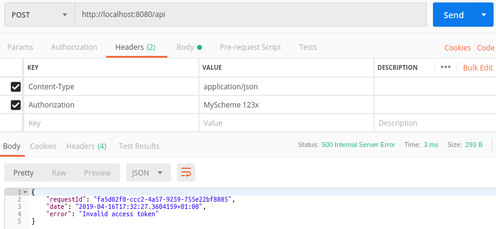

## Walkthrough 4 - Security
Please make sure you have followed at least the first walkthrough as this one follows on from it.

There are a huge number of ways we could tackle security but in this walkthrough we'll cover something that's simple enough to be easy to follow but complex enough that it at least approximates something that you may do in reality.

In order for a request to be authorised it must contain a secret token in it's HTTP Authorization header.

#### 1. Open your Hello World walkthrough project
That's all.

*N.B. The code for these walkthroughs is included in the source respository, as a project per walkthrough.  The code within this walkthrough is taken from these projects and the namespaces will be slightly different to yours if you're following along with your own project.*

#### 2. Specialise the request router
Here we're going to create a subclass of *IntelligentJsonRequestRouter* add add in some code that will allow us to pull the authorisation token out of incomming HTTP requests and attach them to the *IRequest* which our shafts see.

Create a new type called *MyIntelligentJsonRequestRouter.cs* and add the following code.  The comments above the *PreprocessRequest* method explain what it's doing.

```csharp
using System;
using System.Linq;
using System.Net.Http.Headers;
using System.Reflection;
using LogicMine;
using LogicMine.Web;
using Microsoft.AspNetCore.Http;
using Microsoft.Extensions.DependencyInjection;

namespace Security
{
    public class MyIntelligentJsonRequestRouter : IntelligentJsonRequestRouter
    {
        private const string AuthorisationHeaderName = "Authorization";
        private const string AuthorisationSchemeName = "MyScheme";
        private const string AccessTokenOption = "AccessToken";

        private readonly IHttpContextAccessor _httpContextAccessor;

        public MyIntelligentJsonRequestRouter(Assembly serviceAssembly, IServiceCollection serviceCollection,
            IHttpContextAccessor httpContextAccessor, ITraceExporter traceExporter = null) :
            base(serviceAssembly, serviceCollection, traceExporter)
        {
            _httpContextAccessor = httpContextAccessor ?? throw new ArgumentNullException(nameof(httpContextAccessor));
        }

        /// <summary>
        /// This method is called after a request has been parsed but before it's been dispatched to a mine.
        /// The implementation here pulls the Authorization header from HTTP request and adds it to the IRequest.  This
        /// can then be inspected within the mine and the request rejected if the access token is invalid.
        /// </summary>
        /// <param name="request">The parsed request</param>
        protected override void PreprocessRequest(IRequest request)
        {
            var authHeader = _httpContextAccessor.HttpContext.Request.Headers[AuthorisationHeaderName].FirstOrDefault();
            var authHeaderVal = AuthenticationHeaderValue.Parse(authHeader);
            if (authHeaderVal.Scheme.Equals(AuthorisationSchemeName, StringComparison.OrdinalIgnoreCase))
            {
                var accessToken = Uri.UnescapeDataString(authHeaderVal.Parameter);
                request.Options.Add(AccessTokenOption, accessToken);
            }
        }
    }
}
```

#### 3. Use our new request router
In order to do this we must modify *Startup.cs* so that it uses *MyIntelligentJsonRequestRouter* instead of the old *IntelligentJsonRequestRouter*

```csharp
using LogicMine;
using LogicMine.Routing;
using Microsoft.AspNetCore.Builder;
using Microsoft.AspNetCore.Hosting;
using Microsoft.AspNetCore.Http;
using Microsoft.Extensions.DependencyInjection;
using Newtonsoft.Json.Linq;

namespace Security
{
    public class Startup
    {
        public void ConfigureServices(IServiceCollection services)
        {
            services
                .AddSingleton(services)
                .AddSingleton<IHttpContextAccessor, HttpContextAccessor>()
                .AddSingleton<IErrorExporter, MyErrorExporter>()

                .AddSingleton<IRequestRouter<JObject>>(s =>
                    new MyIntelligentJsonRequestRouter(GetType().Assembly, services,
                        s.GetRequiredService<IHttpContextAccessor>()))

                .AddMvc();
        }

        public void Configure(IApplicationBuilder app, IHostingEnvironment env)
        {
            app.UseMvc();
        }
    }
}
```

#### 4. Create a security station
We'll likely want to add our *SecurityStation* to every shaft and for this reason this station is a *FlexibleStation<,>* rather than a *Station<,>* (as we've seen in previous walkthroughs).  

The typical *Station<,>* type places certain restrictions on it's request/response generic parameters to ensure that we can't accidentally define nonsense stations, e.g. one which took a *HelloRequest* and returned a *GetTimeResponse*.  Here though we want our *SecurityStation* to operate on any type of request and response and need to forgo this restriction/protection.

So, this station will accept any type of request and it will look into the requests *Options* (a set of key/value pairs) for the authorisation token which the *MyIntelligentJsonRequestRouter* will have written (assuming the HTTP request contained the correct header).  If the token is correct then things are allowed to continue, otherwise an exception is thrown. 

```csharp
using System;
using System.Threading.Tasks;
using LogicMine;

namespace Security.Mine
{
    public class SecurityStation : FlexibleStation<IRequest, IResponse>
    {
        private const string AccessTokenKey = "AccessToken";
        private const string ValidAccessToken = "123";

        public override Task DescendToAsync(IBasket<IRequest, IResponse> basket)
        {
            if (basket.Request.Options.TryGetValue(AccessTokenKey, out var accessToken))
            {
                if ((string) accessToken == ValidAccessToken)
                    return Task.CompletedTask;
            }

            throw new InvalidOperationException("Invalid access token");
        }
    }
}
```

#### 5. Use the security station
One option that we have is to simply inject the *SecrityStation* into each of our shafts individually, similar to how we injected shafts in the **Stations** walkthrough.  This isn't great though because it means that we've got to remember to add the station to every shaft that we ever create...sooner or later we'll forget to do this and we'll have a vulnerability.

To avoid the problem above we can either: 
  a) subclass the *Shaft<,>* type and ensure that it always contains a *SecurityStation*.
  b) subclass *RequestRegistrar* so that it always builds shafts which include the *SecurityStation*.
  
In our very basic service there's nothing to base our choice of a) or b) on - they're both equally good.  However, in a real application it is quite possible that we will want to have more than one implementation of *ShaftRegistrar* and we'd have to ensure that each implementation builds shafts which include the *SecurityStation*.  For this reason it'll generally be best to go with option a) - shown below.

```csharp
using LogicMine;

namespace Security.Mine
{
    public class MyShaft<TRequest, TResponse> : Shaft<TRequest, TResponse> 
        where TRequest : class, IRequest
        where TResponse : IResponse<TRequest>
    {
        public MyShaft(ITerminal<TRequest, TResponse> terminal, params IStation[] stations) : base(terminal, stations)
        {
            AddToTop(new SecurityStation());
        }
    }
}
```

#### 6. Using the new shaft type
Our existing registrar is still created instances of the default *Shaft<,>* type.  We need to change this so it instead constructs our new, secure shaft type.

```csharp
using LogicMine;

namespace Security.Mine
{
    public class HelloShaftRegistrar : ShaftRegistrar
    {
        public override void RegisterShafts(IMine mine)
        {
            mine.AddShaft(new MyShaft<HelloRequest, HelloResponse>(new HelloTerminal()));
        }
    }
}
```

#### 7. Use the service
The request below is has the same body as the request in the first walkthrough.  The difference here is that there is now an  Authorization header.



And below we see the response when an invalid token is provided


