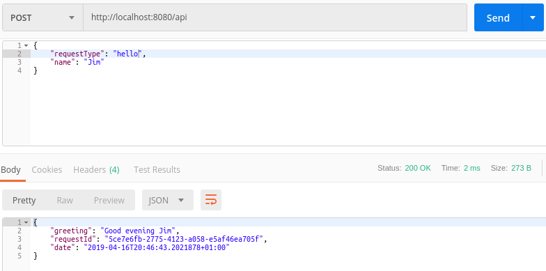

## Walkthrough 6 - Inter-Station Communication
Please make sure you have followed the second walkthrough (Stations) as this one follows on from it.

In a perfect world all of our stations would be completely independant, i.e. they wouldn't rely on other stations doing anything special before they're visited.  If we have this then our stations become coupled (to some degree) and if they're coupled then a change to one station could end up causing problems in another.  We don't want this but we have to live in the real world.

We have some options if we find we want to make one station dependant on the processing of another:

  1) We merge the stations.  This may, or may not make the dangers of coupling worse.  Here we've said these two (what we previously considered) distinct operations are going to become one and there is a very real risk that they will become practically inseperable later.
  
  2) We augment our requests with *internal* properties which allows for one station to set a property and another to read it.  This leads to coupling however it is much looser that with the first option.
  
  3) We write to the *IRequest.Options* dictionary and each station/terminal can inspect and modify this.  This isn't too disimilar to option 2) but it suffers from lack of type safety since all values in the dictionary are just of type *object*.
  
In this walkthrough we'll try out option 2).

#### 1. Open your Stations walkthrough project
N.B. The code for these walkthroughs is included in the source respository, as a project per walkthrough.  The code within this walkthrough is taken from these projects and the namespaces will be slightly different to yours if you're following along with your own project.*

#### 2. Delete the current stations
Delete the files; *ReverseResponseStation.cs*, *MakeNameUppercaseStation.cs* and *SurroundNameWithStarsStation.cs*.

Remove the deleted stations from *HelloShaftRegistrar*.

#### 3. Augment the request
We're going to have a station which works our what part of the day we're currently in, i.e. morning, afternoon, evening or night and the terminal will then use this to improve our greeting.

```csharp
using LogicMine;

namespace InterStationComms.Mine
{
    public class HelloRequest : Request
    {
        public string Name { get; set; }

        internal enum PeriodOfDay
        {
            Morning,
            Afternoon,
            Evening,
            Night
        }

        internal PeriodOfDay Period { get; set; }
    }
}
```

#### 4. Create station to work out period of day
```csharp
using System;
using System.Threading.Tasks;
using LogicMine;

namespace InterStationComms.Mine
{
    public class CalculatePeriodOfDayStation : Station<HelloRequest, HelloResponse>
    {
        public override Task DescendToAsync(IBasket<HelloRequest, HelloResponse> basket)
        {
            var time = DateTime.Now.TimeOfDay;
            if (time >= TimeSpan.FromHours(4) && time < TimeSpan.FromHours(12))
                basket.Request.Period = HelloRequest.PeriodOfDay.Morning;
            else if (time >= TimeSpan.FromHours(12) && time < TimeSpan.FromHours(18))
                basket.Request.Period = HelloRequest.PeriodOfDay.Afternoon;
            else if (time >= TimeSpan.FromHours(18) && time < TimeSpan.FromHours(23))
                basket.Request.Period = HelloRequest.PeriodOfDay.Evening;
            else
                basket.Request.Period = HelloRequest.PeriodOfDay.Night;

            return Task.CompletedTask;
        }
    }
}
```

#### 5. Add the new station to the shaft registrar
```csharp
using LogicMine;

namespace InterStationComms.Mine
{
    public class HelloShaftRegistrar : ShaftRegistrar
    {
        public override void RegisterShafts(IMine mine)
        {
            mine.AddShaft(new Shaft<HelloRequest, HelloResponse>(new HelloTerminal(),
                new CalculatePeriodOfDayStation()));
        }
    }
}
```

#### 6. Use the service



#### Going further
One pattern that you may find interesting is where early stations attach internal Tasks to the request object and then return before the Task has completed.  These Tasks can later be awaited in subsequent stations when the result of the Task is actually required.  With any luck, by the time the result is needed the Task will already have completed, giving you a nice performance boost.      
