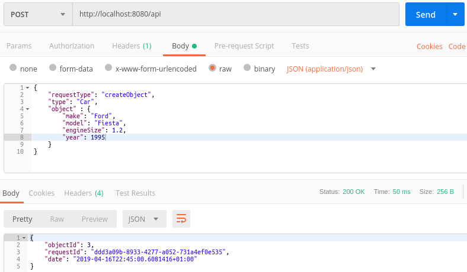
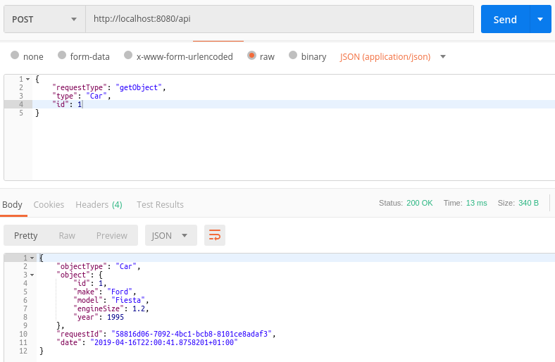
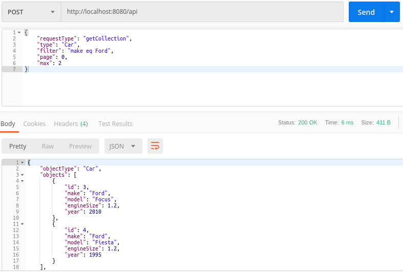
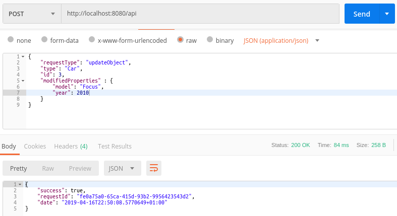
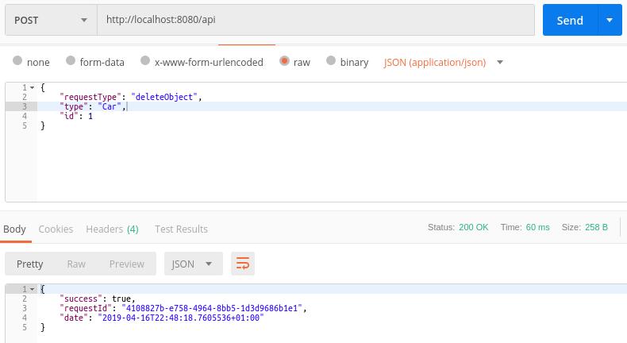

#### Walkthrough 7 - Database
In this walkthrough we'll create a new project and do some work with a database.  In order to be as accessible as possible we'll use SQLite because you won't have to to install anything.

#### 1 . Create a new Web API project

```dotnet new webapi```

#### 2. Add a references

```dotnet add package LogicMine.Web```
```dotnet add package LogicMine.DataObject.Ado.Sqlite```

#### 3. Create the application request Controller
This is exactly the same as the controller in all other walkthroughs.

```csharp
using LogicMine;
using LogicMine.Routing;
using LogicMine.Web;
using Microsoft.AspNetCore.Mvc;
using Newtonsoft.Json.Linq;
    
namespace Database.Controllers
{
    [Route("api")]
	public class MyRequestController : JsonRequestController
	{
	    public MyRequestController(IRequestRouter<JObject> requestRouter) : base(requestRouter)
	    {
	    }
	}
}
```

#### 4. Create an injectable connection string type
It would be nice if we can just discover our DB connection once and then inject it into whichever objects that require it.  Since we're using a DI container the easiest thing to do is create a data type which can be easily resolved as a connection string...if our connection string is just within a *string* object then what's to differentiate it from another string that contains a Mills and Boon classic. 

```csharp
using System;

namespace Database
{
    /// <summary>
    /// This class just exists so that we've got a type to use with the dependency injection container
    /// </summary>
    public class DbConnectionString
    {
        public string Value { get; }

        public DbConnectionString(string value)
        {
            if (string.IsNullOrWhiteSpace(value))
                throw new ArgumentException("Value cannot be null or whitespace.", nameof(value));

            Value = value;
        }
    }
}
```
#### 5. Create a data type to persist
We'll create a simple *Car* type.

```csharp
namespace Database.Mine.Car
{
    public class Car
    {
        public int Id { get; set; }
        public string Make { get; set; }
        public string Model { get; set; }
        public decimal EngineSize { get; set; }
        public int Year { get; set; }
    }
}
```

#### 6. Create a descriptor for our persistent data type
We don't want leaky abstractions which make us to pollute our data types with information that that isn't relevant to they application layer we are operating at - allowing the Car type is a simple POCO.  However we're going to have to have knowledge encoded somewhere of how our .Net types maps the the underlying database.  This is the role of an *IDataObjectDescriptor*.

The descriptor shown below is almost as simple as it gets because we'll have a very clear mapping between the Car class and the underlying Car table. It basically say, the Car type maps to a table called Car with a primary key called Id and the database field that maps to the Car types Id property is read-only.

There are many things you can do with descriptors, such as; define which fields are read/write-only, specify property/field mappings where they don't match the default convention, cooerce values as they are read/written, etc.  The class documentation should help you work things out. 

```csharp
using LogicMine.DataObject.Ado.Sqlite;

namespace Database.Mine.Car
{
    public class CarDescriptor : SqliteMappedObjectDescriptor<Car, int>
    {
        public CarDescriptor() : base("Car", "Id", nameof(Car.Id))
        {
        }
    }
}
```

#### 7. Create a shaft registrar
Our shaft registrar here is slightly different to those of previous walkthroughs because this one descends from *DataObjectShaftRegistrar<,>*.  The *DataObjectShaftRegistrar<,>* automatically registers a number of shaft types which allow us to perform CRUD operations on our data types.  These operations are:

* Get object by Id
* Get a collection of objects - we can get all objects or specify a filter.  Also the results can be paged.
* Create object
* Create a collection of objects
* Update an object by Id
* Delete an object by Id
* Delete a collection of objects which match a filter expression.

```csharp
using System;
using LogicMine;
using LogicMine.DataObject;
using LogicMine.DataObject.Ado.Sqlite;

namespace Database.Mine.Car
{
    public class CarShaftRegistrar : DataObjectShaftRegistrar<Car, int>
    {
        private readonly DbConnectionString _connectionString;

        public CarShaftRegistrar(DbConnectionString connectionString)
        {
            _connectionString = connectionString ?? throw new ArgumentNullException(nameof(connectionString));
        }

        protected override IDataObjectStore<Car, int> GetDataObjectStore()
        {
            return new SqliteMappedObjectStore<Car, int>(_connectionString.Value, new CarDescriptor());
        }

        protected override IShaft<TRequest, TResponse> GetBasicShaft<TRequest, TResponse>(
            ITerminal<TRequest, TResponse> terminal)
        {
            return new Shaft<TRequest, TResponse>(terminal);
        }
    }
}
```

#### 8. Create Startup.cs
Within this startup file we're creating the SQLite database that'll be used by the service and adding a *DbConnectionString* to the DI container.  This connection string will be automatically injected into our *CarShaftRegistrar* as it's being constructed.

```csharp
using System.IO;
using LogicMine.Routing;
using LogicMine.Web;
using Microsoft.AspNetCore.Builder;
using Microsoft.AspNetCore.Hosting;
using Microsoft.Data.Sqlite;
using Microsoft.Extensions.DependencyInjection;
using Newtonsoft.Json.Linq;

namespace Database
{
    public class Startup
    {
        private static readonly string DbFilename = Path.Combine(Path.GetTempPath(), "lm-db-walkthrough.db");

        public void ConfigureServices(IServiceCollection services)
        {
            var requestRouter = new IntelligentJsonRequestRouter(GetType().Assembly, services);

            services
                .AddSingleton(services)
                .AddSingleton<IRequestRouter<JObject>>(requestRouter)
                .AddSingleton(new DbConnectionString(CreateDb()))
                .AddMvc();
        }

        public void Configure(IApplicationBuilder app, IHostingEnvironment env)
        {
            app.UseMvc();
        }

        private string CreateDb()
        {
            if (File.Exists(DbFilename))
                File.Delete(DbFilename);

            var connectionString = $"Data Source={DbFilename}";
            using (var conn = new SqliteConnection(connectionString))
            {
                conn.Open();

                var createCarTableStatement = @"
CREATE TABLE Car 
(
    Id          INTEGER        NOT NULL  PRIMARY KEY,
    Make        NVARCHAR(50)   NOT NULL,
    Model       NVARCHAR(50)   NOT NULL,
    EngineSize  DECIMAL(13,2)  NOT NULL,
    Year        INTEGER        NOT NULL
);";
                using (var cmd = new SqliteCommand(createCarTableStatement, conn))
                {
                    cmd.ExecuteNonQuery();
                }
            }

            return connectionString;
        }
    }
}
```

#### 9. Use the service
There are a number of screenshots below showing various operations that we can now perform on Cars.

N.B. The current implementation is completely reliant on DB level validation which you obviously wouldn't want in a real application.  A later walkthrough will show what can be done here.










