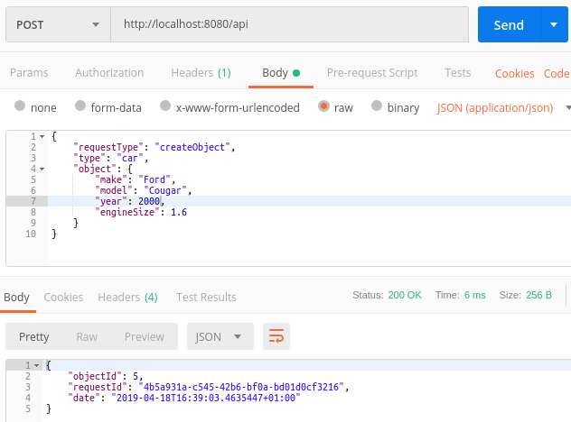
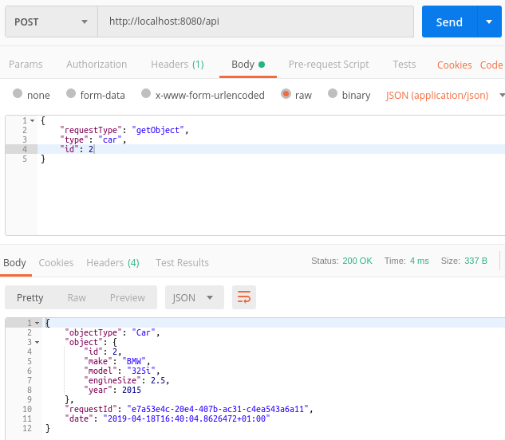
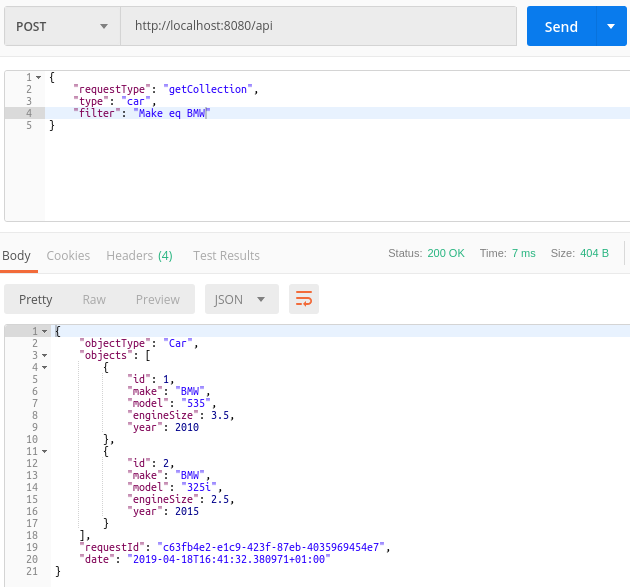
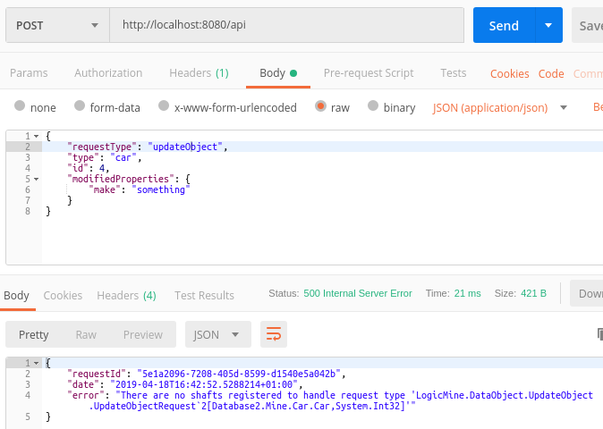
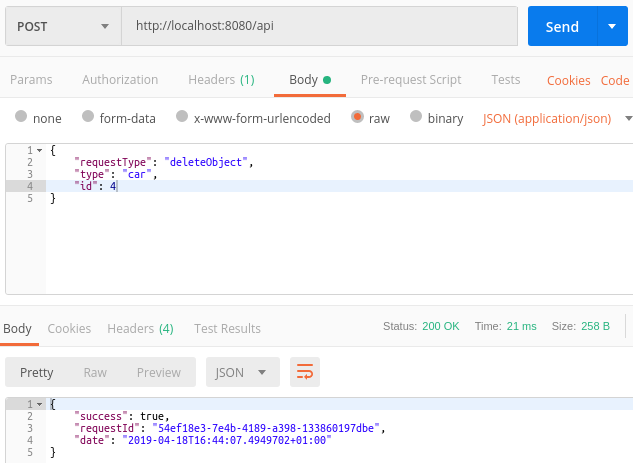

#### Walkthrough 8 - Database 2
With the last walkthrough we went through the process of setting up a set of shafts for performing typical operations on data objects.  Things were very easy because there was a clear mapping mapping between our Car type and the underlying Car table.  In this walkthrough we'll introduce a level of complexity, where the underlying datastore is not a neat mapping to our object model.

We'll be doing this by writing SQL by hand, and will be using only a very light abstraction over ADO.Net.  You will be completely free to do whatever you wanted though in a real application.  You may choose to drop down to pure ADO.Net or use something like the Entity Framework.  A core aim of the design of LogicMine was that it shouldn't stand in your way.

What we're going to do is introduce another table into the database called *Manufacturer* and have a foreign key to this from the *Car* table.  This will mean that the *Make* field on the *Car* table is redundant so will be removed.  While we want to split things up at the database level we want to keep our existing API consistent and so this means there will be no change to the *Car* class and we will be writing some code to allow this to happen. 

#### 1. Open your previous Database walkthrough project
*N.B. The code for these walkthroughs is included in the source respository, as a project per walkthrough.  The code within this walkthrough is taken from these projects and the namespaces will be slightly different to yours if you're following along with your own project.*

#### 2. Modify Startup.cs
We're doing this just because this is where our database schema is defined.  Replace your current *CreateDb* method with the code below.  This new code will create the new *Manufacturer* table and link this to *Car*.

```csharp
private string CreateDb()
{
    if (File.Exists(DbFilename))
        File.Delete(DbFilename);

    var connectionString = $"Data Source={DbFilename}";
    using (var conn = new SqliteConnection(connectionString))
    {
        conn.Open();

        var createManufacturerTableStatement = @"
CREATE TABLE Manufacturer
(
    Id      INTEGER        NOT NULL    PRIMARY KEY,
    Name    NVARCHAR(50)   NOT NULL
);";

        var createCarTableStatement = @"
CREATE TABLE Car 
(
    Id              INTEGER        NOT NULL  PRIMARY KEY,
    ManufacturerId  NVARCHAR(50)   NOT NULL,
    Model           NVARCHAR(50)   NOT NULL,
    EngineSize      DECIMAL(13,2)  NOT NULL,
    Year            INTEGER        NOT NULL,
    FOREIGN KEY(ManufacturerId) REFERENCES Manufacturer(Id)
);";

        using (var cmd = new SqliteCommand(createManufacturerTableStatement, conn))
        {
            cmd.ExecuteNonQuery();
        }

        using (var cmd = new SqliteCommand(createCarTableStatement, conn))
        {
            cmd.ExecuteNonQuery();
        }
    }

    return connectionString;
}
```

#### 3.  Create a validation station
This isn't really anything to do with interacting with a database however, since we're getting a bit further with our project we'd be as well starting to follow better practices.

First create a new station which we'll use to ensure that the cars sent to the service are OK.

```csharp
using System.ComponentModel.DataAnnotations;
using System.Text;
using System.Threading.Tasks;
using LogicMine;
using LogicMine.DataObject.CreateObject;

namespace Database2.Mine.Car.Create
{
    public class ValidationStation : Station<CreateObjectRequest<Car>, CreateObjectResponse<Car, int>>
    {
        public override Task DescendToAsync(IBasket<CreateObjectRequest<Car>, CreateObjectResponse<Car, int>> basket)
        {
            var errors = new StringBuilder();
            var car = basket.Request.Object;

            if (string.IsNullOrWhiteSpace(car.Make) || car.Make.Length > 50)
                errors.AppendLine("Make is required and must be 50 character or less");

            if (string.IsNullOrWhiteSpace(car.Model) || car.Model.Length > 50)
                errors.AppendLine("Model is required and must be 50 character or less");

            if (car.Year == 0)
                errors.Append("Year is required");

            if (errors.Length > 0)
                throw new ValidationException(errors.ToString());

            return Task.CompletedTask;
        }
    }
}
```

#### 4. Inject the validation station
Next update the existing *CarShaftRegistrar* so that we validate new cars that are posted.  To do this we just override the *BuildCreateObjectShaft* method so that we can inject our new station.

N.B. It would make no difference here whether we chose to add the *ValidationStation* to the top of bottom of the shaft because there are no existing stations.  Stations will always sit above the terminal.
```csharp
protected override IShaft<CreateObjectRequest<Car>, CreateObjectResponse<Car, int>> BuildCreateObjectShaft(
            IDataObjectStore<Car, int> objectStore)
{
    return base.BuildCreateObjectShaft(objectStore)
        .AddToBottom(new ValidationStation());
}
```

#### 5. Create an object store
In our last walkthrough we where using an *SqliteMappedObjectStore*, you can verify this by looking at the *GetObjectStore* method in your *CarShaftRegistrar*.  This default implementation gives you everything you need for ORM when our mappings are fairly straight forward.  In our current case though things aren't totally straight forward because we want one class to be mapped over a couple of tables.

The code below is for a custom *CarObjectStore* which overrides some of the funtionality of the base *SqliteMappedObjectStore*.  We won't deal with every eventuality in this code, e.g. we won't worry about updates or batch inserts, but it should be fairly clear how you can do these things based on what you see here and the class level documentation. 

```csharp
using System;
using System.Threading.Tasks;
using LogicMine;
using LogicMine.DataObject.Ado;
using LogicMine.DataObject.Ado.Sqlite;
using LogicMine.DataObject.Filter;
using Microsoft.Data.Sqlite;

namespace Database2.Mine.Car
{
    public class CarObjectStore : SqliteMappedObjectStore<Car, int>
    {
        private const string BaseSelectStatement = @"
SELECT
    Car.Id, Manufacturer.Name AS Make, Car.Model, Car.Year, Car.EngineSize
FROM
    Car
    JOIN Manufacturer ON Car.ManufacturerId = Manufacturer.Id";

        public CarObjectStore(string connectionString, SqliteMappedObjectDescriptor<Car, int> descriptor,
            IDbMapper<Car> mapper = null, ITransientErrorAwareExecutor transientErrorAwareExecutor = null) : base(
            connectionString, descriptor, mapper, transientErrorAwareExecutor)
        {
        }

        protected override IDbStatement<SqliteParameter> GetSelectDbStatement(int identity, string[] fields = null)
        {
            var sql = BaseSelectStatement + " WHERE Car.Id = @CarId";
            return new SqliteStatement(sql, new SqliteParameter("@CarId", identity));
        }

        protected override IDbStatement<SqliteParameter> GetSelectDbStatement(IFilter<Car> filter, int? max = null,
            int? page = null, string[] fields = null)
        {
            if (max != null || page != null)
                throw new NotSupportedException("We won't bother with this here");

            if (filter != null)
            {
                var sqlFilter = GetDbFilter(filter);
                return new SqliteStatement($"{BaseSelectStatement} {sqlFilter.WhereClause}", sqlFilter.Parameters);
            }

            return new SqliteStatement(BaseSelectStatement);
        }

        public override async Task<int> CreateAsync(Car obj)
        {
            var manufacturerId = await GetManufacturerIdAsync(obj.Make).ConfigureAwait(false);

            var sql = @"
INSERT INTO 
    Car 
    (ManufacturerId, Model, Year, EngineSize) 
VALUES 
    (@ManufacturerId, @Model, @Year, @EngineSize);

SELECT last_insert_rowid();";

            var statement = new SqliteStatement(sql,
                new SqliteParameter("@ManufacturerId", manufacturerId),
                new SqliteParameter("@Model", obj.Model),
                new SqliteParameter("@Year", obj.Year),
                new SqliteParameter("@EngineSize", obj.EngineSize));

            // SQLite stores 64 bit integers
            return Convert.ToInt32(await DbInterface.ExecuteScalarAsync(statement).ConfigureAwait(false));
        }

        private async Task<int> GetManufacturerIdAsync(string name)
        {
            var selectSql = "SELECT Id FROM Manufacturer WHERE Name = @Name";
            var selectStatement = new SqliteStatement(selectSql, new SqliteParameter("@Name", name));
            using (var rdr = await DbInterface.GetReaderAsync(selectStatement).ConfigureAwait(false))
            {
                if (rdr.Read())
                {
                    // SQLite stores 64 bit integers
                    return Convert.ToInt32(rdr["Id"]);
                }

                var inserSql = @"
INSERT INTO Manufacturer (Name) VALUES (@Name);
SELECT last_insert_rowid();";

                var statement = new SqliteStatement(inserSql, new SqliteParameter("@Name", name));

                // SQLite stores 64 bit integers
                return Convert.ToInt32(await DbInterface.ExecuteScalarAsync(statement).ConfigureAwait(false));
            }
        }
    }
}
```

#### 6. Use the new CarObjectStore
As you may have guessed the next step is to update our *CarShaftRegistrar* so that it uses our new *CarObjectStore*.  

```csharp
protected override IDataObjectStore<Car, int> GetDataObjectStore()
{
    return new CarObjectStore(_connectionString.Value, new CarDescriptor());
}
```

#### 7. Disable the operations we didn't bother implementing
Since we're no longer supporting updates and bulk inserts for cars we'd be better to disable these operations completely rather than leaving the default implementation in place.

Again open *CarShaftRegistrar* and now add the following:

```csharp
protected override IShaft<CreateCollectionRequest<Car>, CreateCollectionResponse<Car>>
    BuildCreateCollectionShaft(IDataObjectStore<Car, int> objectStore)
{
    return null;
}

protected override IShaft<UpdateObjectRequest<Car, int>, UpdateObjectResponse<Car, int>> BuildUpdateObjectShaft(
    IDataObjectStore<Car, int> objectStore)
{
    return null;
}
```

#### 8. Use the service
There are a number of screenshots below showing various operations that we can now perform on Cars.

**Create Object**


**Get Object**


**Get Filtered**


**Update Object**


**Delete Object**

