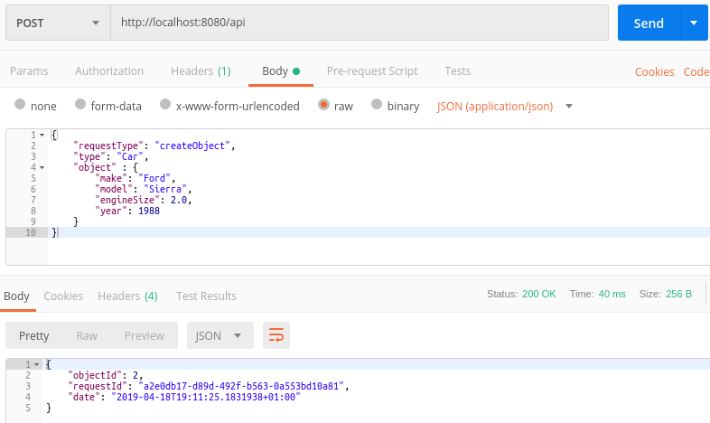
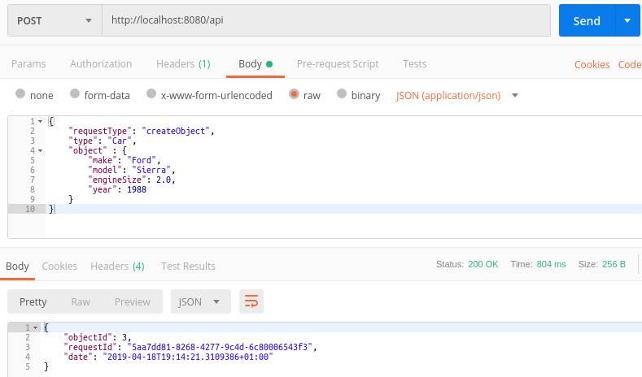

#### Walkthrough 9 - Resilience & Transient Faults
If you are developing "cloud" based systems then you'll be aware that transient errors can happen, i.e. you attempt to connect to a database service but for one reason or another you can't.  LogicMine itself does not provide any real logic to help you deal with these types of error however it does give you the ability to define your own fault handling logic and or to use another library specifically designed for the purpose.

In this walkthrough we'll build our own, very primitive fault tolerance into the system.  In real life applications it's advisable to use a library which has been specifically designed for this, such as [Polly](https://github.com/App-vNext/Polly). 

#### 1. Open your Database walkthrough project
*N.B. The code for these walkthroughs is included in the source respository, as a project per walkthrough.  The code within this walkthrough is taken from these projects and the namespaces will be slightly different to yours if you're following along with your own project.*

#### 2. Implement an ITransientErrorAwareExecutor
Operations in LogicMine which are liable to fail transiently (e.g. calls to a datastore) can be passed through an implementation of *ITransientErrorAwareExecutor*.  Implementations of this interface can be as simple or complex as you wish, however chances are your best bet is to use it as a wrapper around something like [Polly](https://github.com/App-vNext/Polly).

Here we're just going to do the bare minimum to demonstrate the concept.  Create a class called *MyTransientErrorAwareExecutor* with the following code.  Whenever calls are made to the database with LogicMine and an *ITransientErrorAwareExecutor* is available then these database calls will be passed into the version of *ExecuteAsync* which has been implemented.  Our implementation will quite simply retry the operation if an exception occurs up to 3 times, with a pause of 0.75 seconds between each attempt.

```csharp
using System;
using System.Threading;
using System.Threading.Tasks;
using LogicMine;

namespace Resilience
{
    public class MyTransientErrorAwareExecutor : ITransientErrorAwareExecutor
    {
        public void Execute(Action operation)
        {
            // we won't need this
            throw new NotImplementedException();
        }

        public Task ExecuteAsync(Func<Task> operation)
        {
            // we won't need this
            throw new NotImplementedException();
        }

        public TResult Execute<TResult>(Func<TResult> operation)
        {
            // we won't need this
            throw new NotImplementedException();
        }

        public async Task<TResult> ExecuteAsync<TResult>(Func<Task<TResult>> operation)
        {
            Exception exception = null;
            for (var i = 0; i < 3; i++)
            {
                try
                {
                    return await operation();
                }
                catch (Exception ex)
                {
                    exception = ex;
                }

                Thread.Sleep(750);
            }

            throw new InvalidOperationException($"Operation failed after 3 attempts: {exception?.Message}", exception);
        }
    }
}
```

#### 3. Simulate a transient error and hook up our fault handler
One way we can cause our own transient errors to occur is by cycling between having a valid and invalid database schema.  For this we'll create a timer that fires every 1.5 seconds and on each execution it will rename the *Car* table.  The end result will be that we've an invalid schema for the application 50% of the time...which is hopefully much worse than you're used to!

Since our retry strategy is to retry every 0.75 seconds up to 3 times this should mean that all of our calls succeed.  However the calls that are made when the schema is invalid will be considerably slower to return.

We'll add this code to Startup.cs and while we're at it hook up our fault handler with the DI container.

```csharp
using System;
using System.IO;
using System.Runtime.CompilerServices;
using System.Threading;
using LogicMine;
using LogicMine.Routing;
using LogicMine.Web;
using Microsoft.AspNetCore.Builder;
using Microsoft.AspNetCore.Hosting;
using Microsoft.Data.Sqlite;
using Microsoft.Extensions.DependencyInjection;
using Newtonsoft.Json.Linq;

namespace Resilience
{
    public class Startup
    {
        private Timer _timer;
        private static readonly string DbFilename = Path.Combine(Path.GetTempPath(), "lm-db-walkthrough.db");

        public void ConfigureServices(IServiceCollection services)
        {
            var dbConnString = CreateDb();
            CauseChaos();

            var requestRouter = new IntelligentJsonRequestRouter(GetType().Assembly, services);
            services
                .AddSingleton(services)
                .AddSingleton<IRequestRouter<JObject>>(requestRouter)
                .AddSingleton(new DbConnectionString(dbConnString))
                .AddSingleton<ITransientErrorAwareExecutor, MyTransientErrorAwareExecutor>()
                .AddMvc();
        }

        public void Configure(IApplicationBuilder app, IHostingEnvironment env)
        {
            app.UseMvc();
        }

        private void CauseChaos()
        {
            StrongBox<int> boxedInt = new StrongBox<int>(0);
            TimerCallback tweakBadColumn = (state) =>
            {
                var box = (StrongBox<int>) state;

                if (box.Value % 2 == 0)
                    BreakDb();
                else
                    FixDb();

                box.Value++;
            };

            _timer = new Timer(tweakBadColumn, boxedInt, TimeSpan.FromMilliseconds(1500),
                TimeSpan.FromMilliseconds(1500));
        }

        private string CreateDb()
        {
            if (File.Exists(DbFilename))
                File.Delete(DbFilename);

            var connectionString = $"Data Source={DbFilename}";
            using (var conn = new SqliteConnection(connectionString))
            {
                conn.Open();

                var createCarTableStatement = @"
CREATE TABLE Car 
(
    Id          INTEGER        NOT NULL  PRIMARY KEY,
    Make        NVARCHAR(50)   NOT NULL,
    Model       NVARCHAR(50)   NOT NULL,
    EngineSize  DECIMAL(13,2)  NOT NULL,
    Year        INTEGER        NOT NULL
);";
                using (var cmd = new SqliteCommand(createCarTableStatement, conn))
                {
                    cmd.ExecuteNonQuery();
                }
            }

            return connectionString;
        }

        private void BreakDb()
        {
            Console.WriteLine("Broken");
            var connectionString = $"Data Source={DbFilename}";
            using (var conn = new SqliteConnection(connectionString))
            {
                conn.Open();
                using (var cmd = new SqliteCommand("ALTER TABLE Car RENAME TO Argh;", conn))
                {
                    cmd.ExecuteNonQuery();
                }
            }
        }

        private void FixDb()
        {
            Console.WriteLine("Fixed");
            var connectionString = $"Data Source={DbFilename}";
            using (var conn = new SqliteConnection(connectionString))
            {
                conn.Open();
                using (var cmd = new SqliteCommand("ALTER TABLE Argh RENAME TO Car;", conn))
                {
                    cmd.ExecuteNonQuery();
                }
            }
        }
    }
}
```

#### 4. Inject the fault handler into the object store
Finally, open the existing *CarShaftRegistrar* and add an *ITransientErrorAwareExecutor* parameter to the constructor, capture this and then inject it into the *SqliteMappedObjectStore<,>* in the *GetDataObjectStore* method.  An instance of our fault handler will be automatically injected into our registrar by the DI container.

```csharp
using System;
using LogicMine;
using LogicMine.DataObject;
using LogicMine.DataObject.Ado.Sqlite;

namespace Resilience.Mine.Car
{
    public class CarShaftRegistrar : DataObjectShaftRegistrar<Car, int>
    {
        private readonly DbConnectionString _connectionString;
        private readonly ITransientErrorAwareExecutor _transientErrorAwareExecutor;

        public CarShaftRegistrar(DbConnectionString connectionString,
            ITransientErrorAwareExecutor transientErrorAwareExecutor)
        {
            _connectionString = connectionString ?? throw new ArgumentNullException(nameof(connectionString));
            _transientErrorAwareExecutor = transientErrorAwareExecutor;
        }

        protected override IDataObjectStore<Car, int> GetDataObjectStore()
        {
            return new SqliteMappedObjectStore<Car, int>(_connectionString.Value, new CarDescriptor(), null,
                _transientErrorAwareExecutor);
        }

        protected override IShaft<TRequest, TResponse> GetBasicShaft<TRequest, TResponse>(
            ITerminal<TRequest, TResponse> terminal)
        {
            return new Shaft<TRequest, TResponse>(terminal);
        }
    }
}
```

#### 5. Use the service
Below is a couple of screenshots of Postman. The first was issued when there was no underlying error and you will see at the bottom right of the image that the time this took to complete was 40ms (remember this is SQLite and transactions are a little slow).  The second was issued when the database schema was erroneous and this took 804ms to complete because a retry was required.

**No Retry**




**With Retry**


