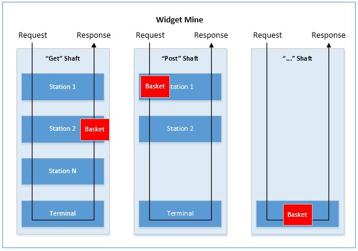
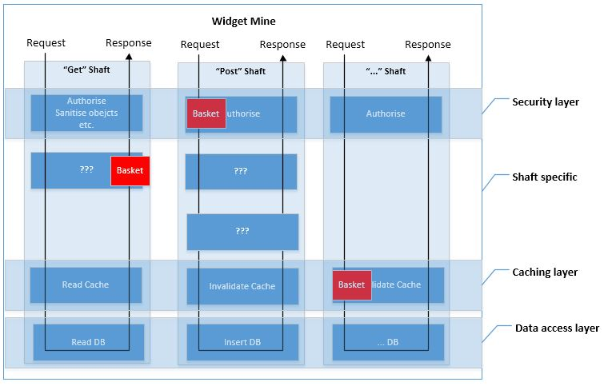
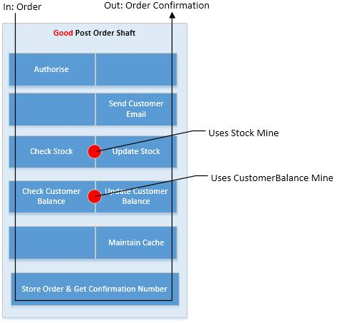
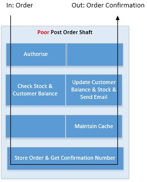

# LogicMine (master)

*Master is currently v2 (beta) - documentation will be updated once it's completely stable*

LogicMine provides an evolved implementation of the [mediator pattern](https://en.wikipedia.org/wiki/Mediator_pattern).  The aim is to help you develop systems which are highly maintainable.

At its core, a LogicMine is a data structure (.Net Standard 2.0) which can be used to organise functionality.  A *mine* is a group of *shafts* and a shaft contains one or more *waypoints*.  *Baskets* travel along shafts and can be processed (or ignored) by the waypoints it passes.  Basically, baskets represent requests and responses and waypoints are units of work.

Each mine deals with a particular type and these types may represent anything you like, such as: 

* data which is stored in some backing store, e.g. a *Customer* which is backed up in a MySql database
* data which is dynamically generated, e.g. an *InterestRate* which is calculated on demand
* operations, e.g. *AccountActivation*
* etc.

The diagram below shows what a mine for Widget objects may look like.

As you've probably realised, a shaft is basically a processing pipeline and a mine is a logical grouping of these.  From this basic structure it is possible to build entire applications.

### Motivation

Developing large systems that remain highly maintainable is hard, especially when the system is developed by a team.  There are many patterns and practices that can help achieve the goal, e.g. SOLID principles, Domain Driven Design, etc. however unless these practices are followed properly, consistently, and by all developers it is likely just a matter of time before rot sets in and your codebase becomes fragile and expensive to maintain.

LogicMine is an attempt at giving developers a solid, easily understandable architecture on which to build well-formed software, using practices which have been demonstrated over the years to lead to highly maintainable systems. It also aims to be completely extensible so as not to become a limiting factor in any of your future design decisions.

While developing with LogicMine can be very productive it is not striving to allow you to develop software faster than ever before. Early, rapid development is very often a false economy, where the price for a few months of easy development is years of hacking at a fragile codebase - which is slow, error prone and will very often dwarf the original savings.

*N.B. There can be no claim that by using LogicMine you will magically end up with a high quality system, nothing can promise this.  If you use it poorly you will still end up with poor quality software.  LogicMine is simply trying to make it a little easier for you to make good design decisions and bit harder to make poor ones.*

### Digging a little deeper

As mentioned in the introduction, a mine consists of shafts and a shaft consists of waypoints.  There are actually two kinds of waypoint; *stations* and *terminals*.  Every shaft has exactly one terminal and this is always at the bottom of the shaft.  There may be zero or more stations above the terminal.  

A basket, which is effectively a container for requests and responses, travels down a shaft through all stations until it hits the terminal.  Each station has the opportunity to inspect and manipulate the contents of the basket on its descent and if it so choses can cancel the journey (providing its own response if it wishes).  Should the basket hit the terminal a response will be generated and added to the basket and the basket is sent back up the shaft again.  On its way up, the basket will once more go through each station and again these have the opportunity to inspect and manipulate the contents of the basket.

A mine itself does next to nothing, it's primarily an organisational structure. The most important structure is a shaft as this is where all processing occurs.  An entire application could be built with shafts alone however coding such an application would be very tedious and likely end up being overly complicated. 

Since a mine is simply a grouping of shafts you may think that building an application with mines would be similarly tedious, and you would be right.  To cut down on the tedium, mines can be built up in layers while still preserving the desired shaft structure.

The diagram below shows our Widget mine built using layers.  A layer is simply a cross section of the mine which contains a set of related waypoints.  Typically these layers will be general in nature e.g. a data access, a caching, a security, etc. and can therefore be used in many mines.

Since the shaft structure is still preserved we can still easily add shaft specific waypoints where required.

### Coupling is evil

A key concept that must be understood is that waypoints within a mine SHOULD be relatively small and as loosely coupled as possible.  What we are aiming for are shafts where you can add and remove waypoints with little fear of corrupting the shaft.  In an ideal world you'd never edit a waypoint (since each edit introduces risk) and by keeping waypoints small and to the point you reduce the likelihood of needing/wanting to do this.

If you find you are developing one waypoint, and this is reliant on something very specific happening in another then you should take a step back and evaluate the situation.  The moment any two components (in any application) become coupled is the moment you are introducing fragility into the system, i.e. you change one and accidentally break the other.  Perhaps these two waypoints should be merged, perhaps the process needs some more thought...it'll be your call.  Similarly, if you find that you are editing the same waypoint frequently then you should ask yourself if this waypoint has too many concerns and should be broken apart.

The diagram below shows a good shaft configuration. Here each waypoint has a single responsibility and is pretty much independent of the others.  This means you could potentially add new waypoints and alter/remove existing waypoints without breaking the application.  In addition to the safety aspect, a shaft with independent waypoints could be easily configured differently for different situations.  For example, if this shaft was part of an off-the-shelf shopping cart system then certain companies may wish to switch out the "Send Email" station for a "Send SMS" station.

The diagram below shows a less than ideal shaft configuration that performs the same functionality as the one above.  This one is obviously a bit simpler looking, and it would probably be a bit simpler to initially implement too.  However maintenance of this could be much more complex and expensive than the previous shaft.  Here, whenever you need to make a change to the order placement process you could be in around complex code that has multiple responsibilities which have become intertwined, making alterations much more error prone.  In addition to this, you can forget about the easy switching out of functionality.

### Building API's
While you can use LogicMine within any type of application it is especially well suited to the development of message based API’s.

Generally speaking, message based API’s can be much more maintainable than procedure based API’s.  A couple of the most compelling benefits are:

* Versioning is generally easier.  If you change a method signature then there’s a very good chance you will also have modify all callers.  If however you pass messages it is often possible to build upon the structure of these messages without impacting existing callers.
 
* Making system wide changes is generally simpler and safer.  With message based API’s all messages can be funnelled through a small set of entry points.  For example, there may be a general *Get(TMessage)* entry point which is called whether you are requesting Car’s, People, Widgets, or whatever other type you can imagine.  This means that a change to this single entry point (adding logging for example) is effectively applied to every call to get something.  With procedure based API’s you end up with a very high number of entry points and therefore it can be much harder to apply system wide changes.

### Usage
*N.B. These walkthroughs are a work in progress and almost certainly full of typos.*

[1. Hello World](https://github.com/tdinucci/LogicMine/blob/master/Doc/Walkthrough-1_Hello-World.md)

[2. Stations](https://github.com/tdinucci/LogicMine/blob/master/Doc/Walkthrough-2_Stations.md)

[3. Cross Shaft](https://github.com/tdinucci/LogicMine/blob/master/Doc/Walkthrough-3_Cross-Shaft.md)

[4. Security](https://github.com/tdinucci/LogicMine/blob/master/Doc/Walkthrough-4_Security.md)

[5. Tracing](https://github.com/tdinucci/LogicMine/blob/master/Doc/Walkthrough-5_Tracing.md)

[6. Inter-station Communication](https://github.com/tdinucci/LogicMine/blob/master/Doc/Walkthrough-6_Inter-Station-Communication.md)

[7. Database](https://github.com/tdinucci/LogicMine/blob/master/Doc/Walkthrough-7_Database.md)

### Dependencies

LogicMine.DataObject depends on https://github.com/mgravell/fast-member

